# Wuthering Waves Themes

A **fan‑made** collection of VS Code color themes inspired by the *beloved characters* of **Wuthering Waves**.  
Each theme is *pre‑configured* for its character – *simply select the theme you want.*

## ☁ Features

♡ **10 character‑specific themes** - *with more to come!*
♡ *Light* (`vs`) and *Dark* (`vs-dark`) variants for every character.
♡ Perfect for **WUWA fans** who want their editor to feel like their *favorite character*.

## ☁ Installation

1. Open **Extensions** (`Ctrl+Shift+X`).
2. Search for `Wuthering Waves Themes` (publisher `frostmoon‑dev`).
3. Click **Install**.
4. Open the **Command Palette** (`Ctrl+Shift+P`) → *Preferences: Color Theme* → *pick your character.*

## ☁ Ready‑to‑Use Themes

All themes are *fully configured* and *ready to use*.  
Just pick a character theme from the VS Code color‑theme picker – *no further tweaks are required.*

## ☁ Screenshots

### Light Themes

| Jinhsi | Changli | Camellya |
|:---:|:---:|:---:|
| 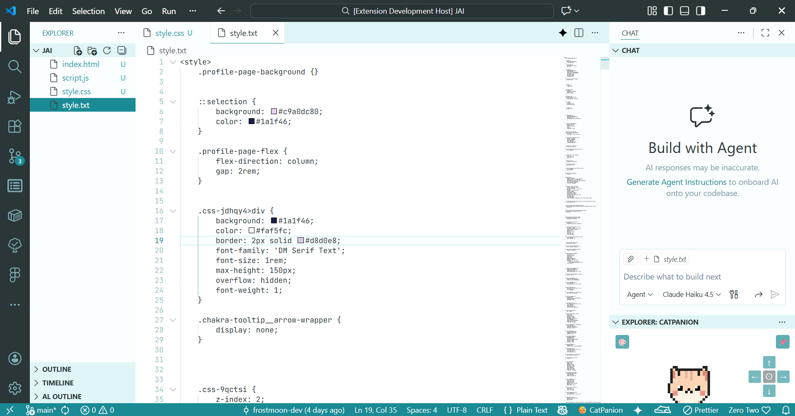 | 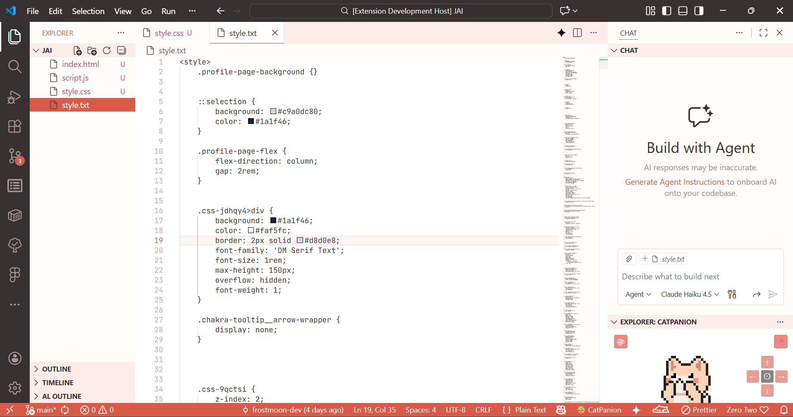 | 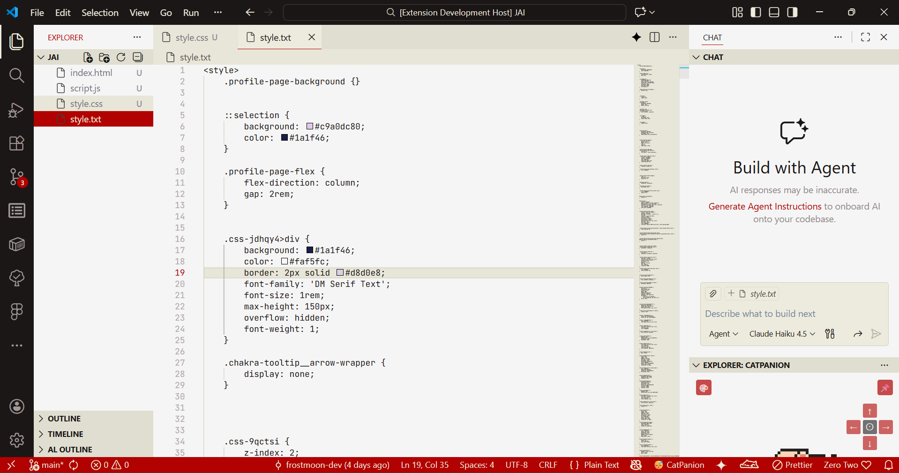 |

| Rover | Phoebe | Brant |
|:---:|:---:|:---:|
| 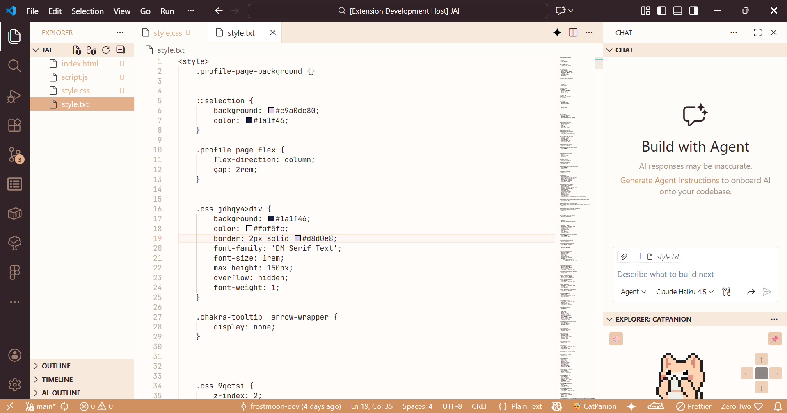 | 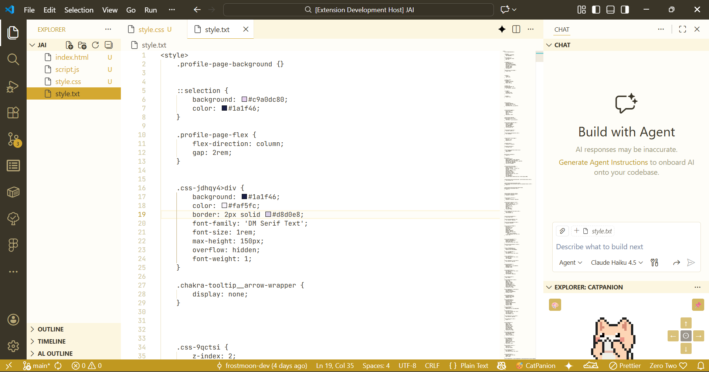 | 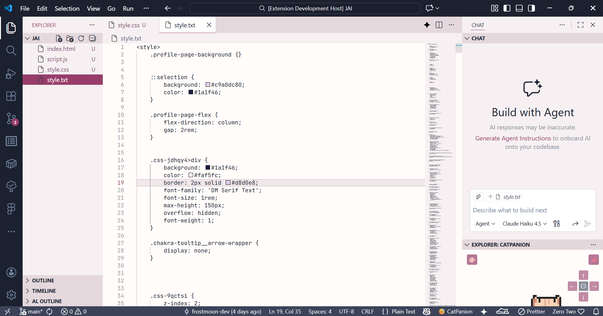 |

| Carlotta | Cartethyia | Iuno |
|:---:|:---:|:---:|
| 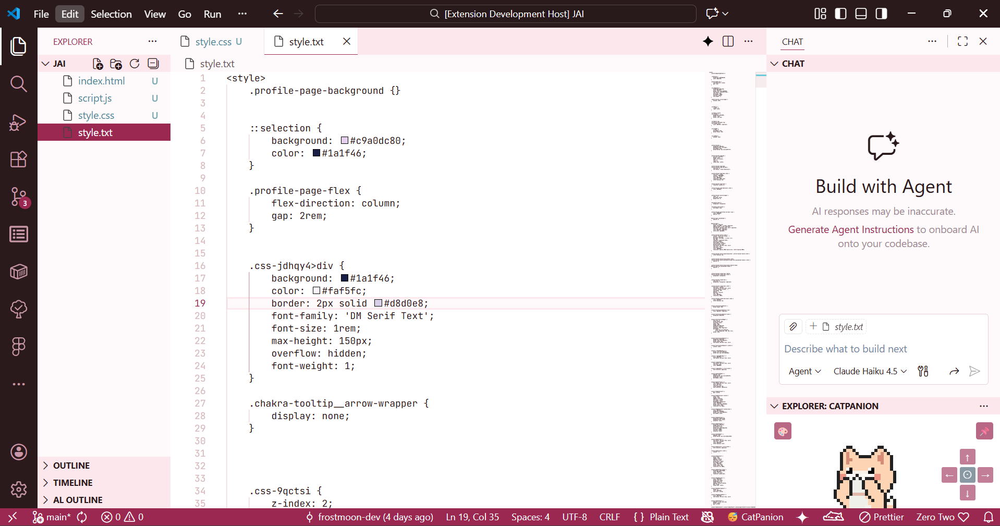 | 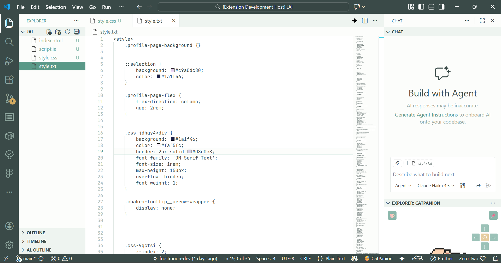 | 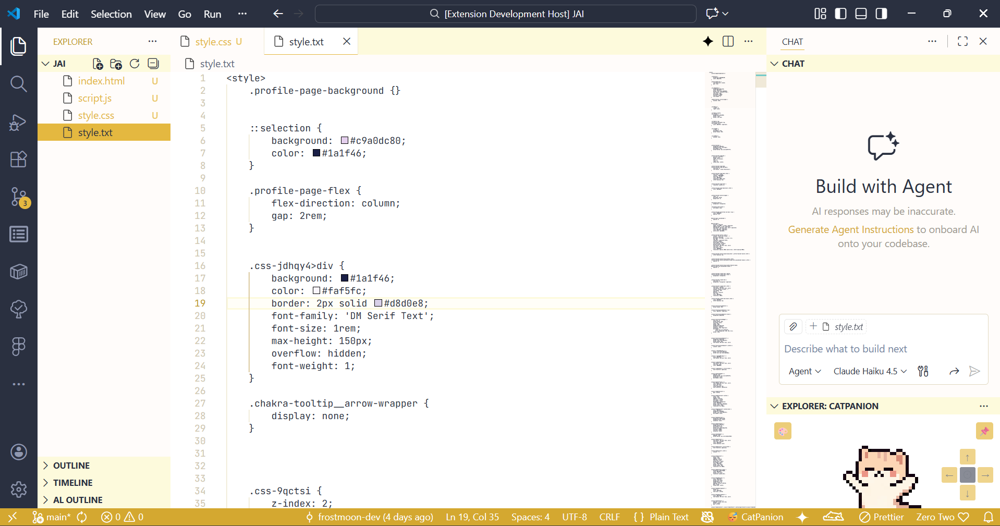 |

### Dark Themes

| Jinhsi (Dark) | Changli (Dark) | Camellya (Dark) |
|:---:|:---:|:---:|
|  | 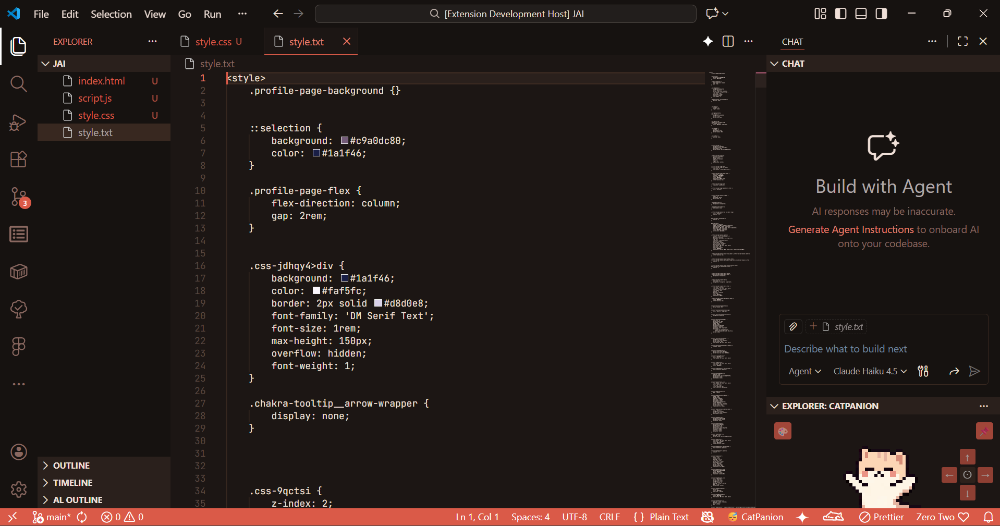 | 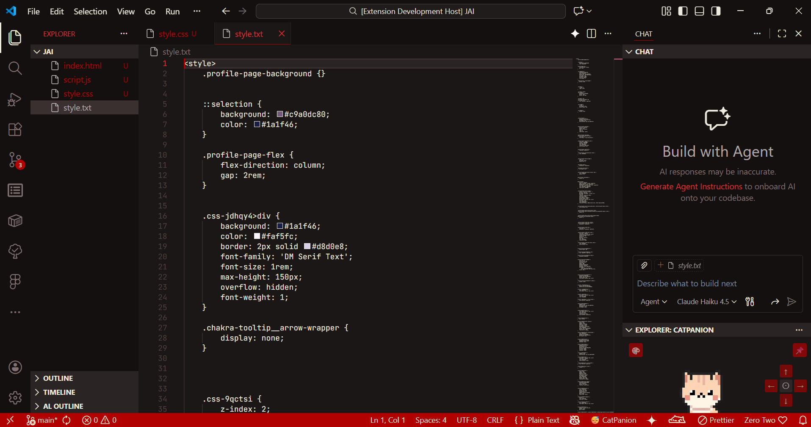 |

## ☁ License

MIT

---

*Made with ♡ for the **WUWA** community.*
